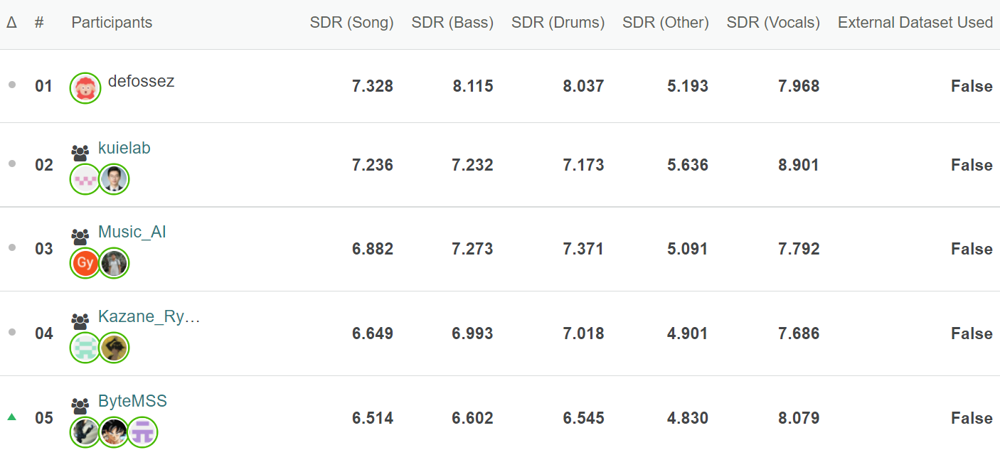

This repository contains the training code of our winning model at [Music Demixing Challenge 2021](https://www.aicrowd.com/challenges/music-demixing-challenge-ismir-2021), which got the 4th place on leaderboard A (6th in overall), and help us (*Kazane Ryo no Danna*) winned the bronze prize.  



## Model Summary

Our final winning approach blends the outputs from three models, which are:

1. model 1: A X-UMX model [1] which is initialized with the weights of the official baseline, and is fine-tuned with a modified **Combinational Multi-Domain Loss** from [1]. In particular, we implement and apply a differentiable **Multichannel Wiener Filter** (MWF) [2] before the loss calculation, and compute the frequency-domain L2 loss with raw complex values.

2. model 2: A U-Net which is similar to **Spleeter** [3], where all convolution layers are replaced by D3 Blocks from [4], and two layers of 2D local attention are applied at the bottleneck similar to [5].

3. model 3: A modified version of **Demucs** [6], where the original decoding module is replaced by four independent decoders, each of which corresponds to one source.

We didn't encounter overfitting in our pilot experiments, so we used the full musdb training set for all the models above, and stopped training upon convergence of the loss function.

The weights of the three outputs are determined empirically:

|         | Drums | Bass | Other | Vocals |
|---------|-------|------|-------|--------|
| model 1 | 0.2   | 0.1  | 0     | 0.2    |
| model 2 | 0.2   | 0.17 | 0.5   | 0.4    |
| model 3 | 0.6   | 0.73 | 0.5   | 0.4    |

For the spectrogram-based models (model 1 and 2), we apply MWF to the outputs with one iteration before the fusion.

[1] Sawata, Ryosuke, et al. "All for One and One for All: Improving Music Separation by Bridging Networks." ICASSP 2021-2021 IEEE International Conference on Acoustics, Speech and Signal Processing (ICASSP). IEEE, 2021.

[2] Antoine Liutkus, & Fabian-Robert Stöter. (2019). sigsep/norbert: First official Norbert release (v0.2.0). Zenodo. https://doi.org/10.5281/zenodo.3269749

[3] Hennequin, Romain, et al. "Spleeter: a fast and efficient music source separation tool with pre-trained models." Journal of Open Source Software 5.50 (2020): 2154.

[4] Takahashi, Naoya, and Yuki Mitsufuji. "D3net: Densely connected multidilated densenet for music source separation." arXiv preprint arXiv:2010.01733 (2020).

[5] Wu, Yu-Te, Berlin Chen, and Li Su. "Multi-Instrument Automatic Music Transcription With Self-Attention-Based Instance Segmentation." IEEE/ACM Transactions on Audio, Speech, and Language Processing 28 (2020): 2796-2809.

[6] Défossez, Alexandre, et al. "Music source separation in the waveform domain." arXiv preprint arXiv:1911.13254 (2019).


## How to reproduce the training

### Install Requirements / Build Virtual Environment

We recommend using conda.

```commandline
conda env create -f environment.yml
conda activate demixing
```

### Prepare Data

Please download [musdb](https://zenodo.org/record/3338373), and edit the `"root"` parameters in all the json files listed under `configs/` to the path where you have the dataset.

### Training Model 1

First download the pre-trained model:

```commandline
wget https://zenodo.org/record/4740378/files/pretrained_xumx_musdb18HQ.pth
```

Copy the weights for initializing our model:

```commandline
python xumx_weights_convert.py pretrained_xumx_musdb18HQ.pth xumx_weights.pth
```

Start training!

```commandline
python train.py configs/x_umx_mwf.json --weights xumx_weights.pth
```

Checkpoints will be located under `saved/`.
The config was set to run on a single RTX 3070.

### Training Model 2


```commandline
python train.py configs/unet_attn.json --device_ids 0 1 2 3
```

Checkpoints will be located under `saved/`.
The config was set to run on four Tesla V100.

### Training Model 3


```commandline
python train.py configs/demucs_split.json
```

Checkpoints will be located under `saved/`.
The config was set to run on a single RTX 3070, using gradient accumulation and mixed precision training.

### Tensorboard Logging

You can monitor the training process using tensorboard:

```commandline
tesnorboard --logdir runs/
```

## Inference

First make sure you installed [danna-sep](https://github.com/yoyololicon/danna-sep). Then convert your checkpoints into jit scripts and replace the files under `DANNA_CHECKPOINTS`:

```commandline
python jit_convert.py configs/x_umx_mwf.json saved/CrossNet\ Open-Unmix_checkpoint_XXX.pt $DANNA_CHECKPOINTS/xumx_mwf.pth

python jit_convert.py configs/unet_attn.json saved/UNet\ Attention_checkpoint_XXX.pt $DANNA_CHECKPOINTS/unet_attention.pth

python jit_convert.py configs/demucs_split.json saved/DemucsSplit_checkpoint_XXX.pt $DANNA_CHECKPOINTS/demucs_4_decoders.pth

```
Now you can use `danna-sep` to separate you favorite music and see how it works!


## Additional Resources

* [Town Hall Presentation Slides](https://www.slideshare.net/ChinYunYu/mdx-challenge-2021-town-hall-presentation)
* [Town Hall Recording](https://youtu.be/TntPVZ4ajIk)
* [Music Demixing Challenge at ISMIR 2021](https://arxiv.org/abs/2108.13559)